<!-- PROJECT LOGO -->

  <a href="https://github.com/Phantom586/NoQ_Customer">
    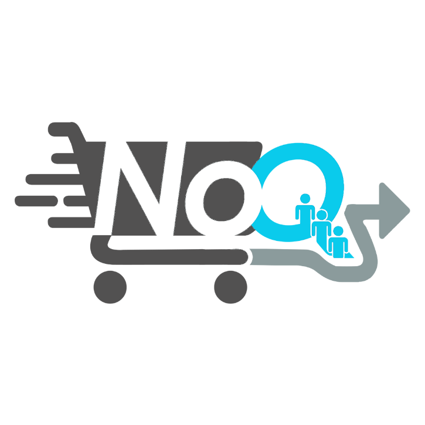
  </a>

  <h3 align="center">NoQ Customer</h3>
  
  

    E-Commerce Android Application.
  

<!-- ABOUT THE PROJECT -->
## About The Project

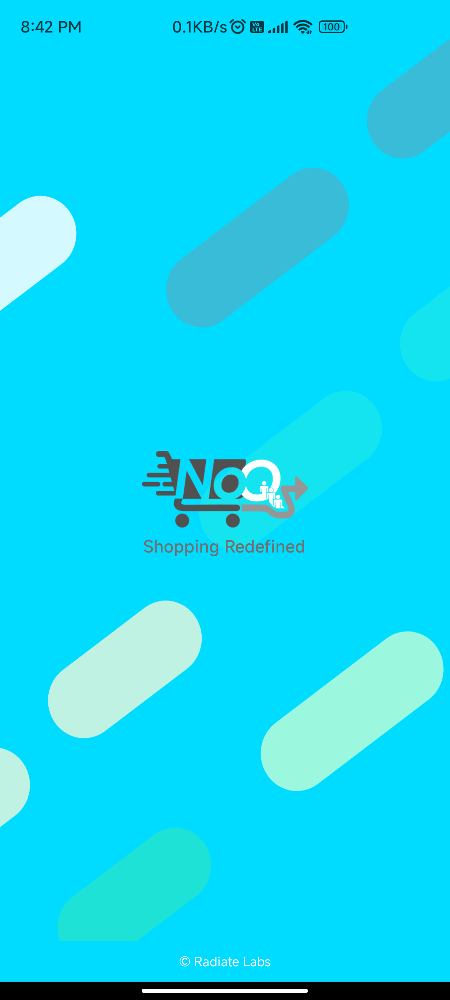

This is an E-Commerce Android App, that focuses on aggregating both local shop owners and large scale shops and bringing their business online, main aim of the app is to make the user's shopping process as seamless and queue-free as possible.

As this app provides a barcode scanner, through which users can directly scan the products and add them to their cart and make payment online from within the app.

Core Functionalities of the App :
* Complete Login, SignUp, Forgot Password & Change Password.
* Choose stores near your area, and shop online, request for a takeaway or online delivery of the goods.
* Complete Cart Functionality i.e, (Add/Edit & Delete Products).
* Search Products by Name.
* Users can see their history of Orders and Invoices, in the Orders Section. 

## Below are some in-app screenshots.

  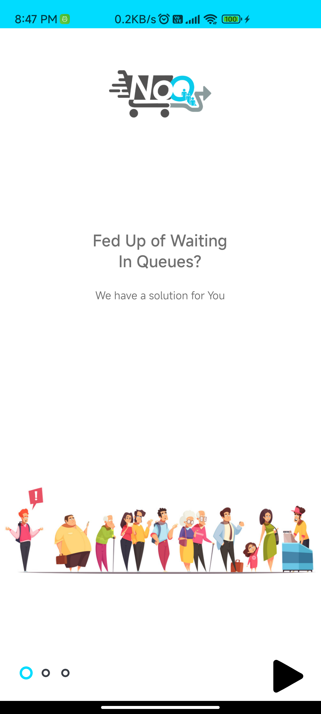
  &nbsp;&nbsp;
  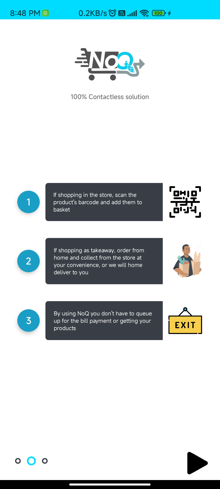
   &nbsp;&nbsp;
  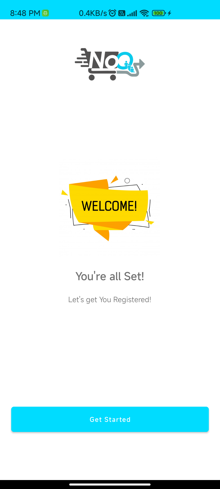

 

  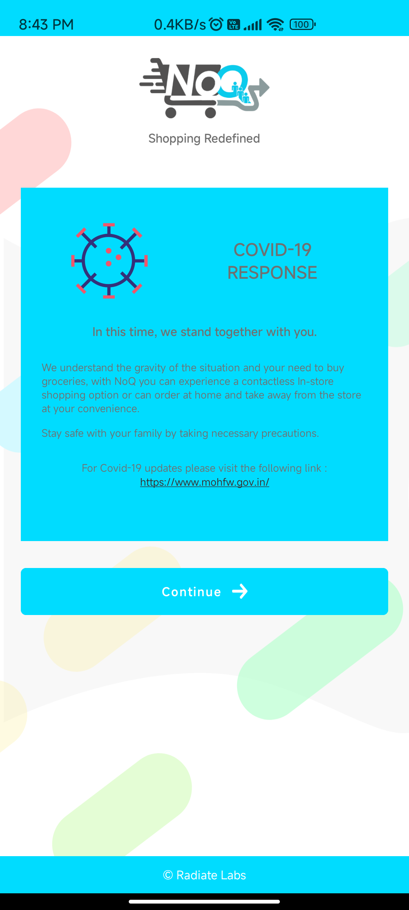
  &nbsp;&nbsp;
  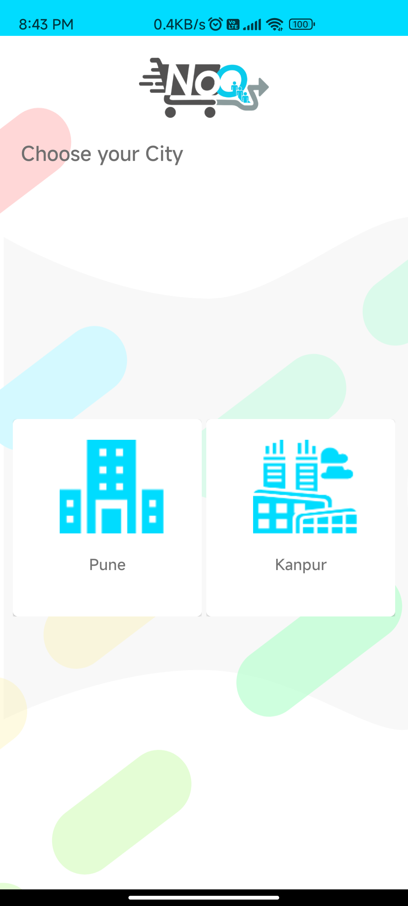
   &nbsp;&nbsp;
  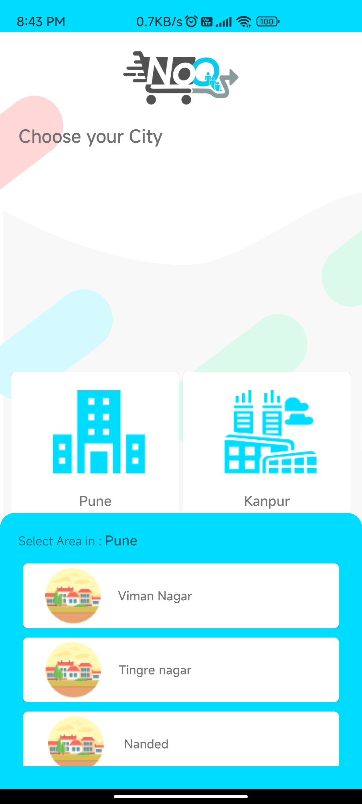

 

  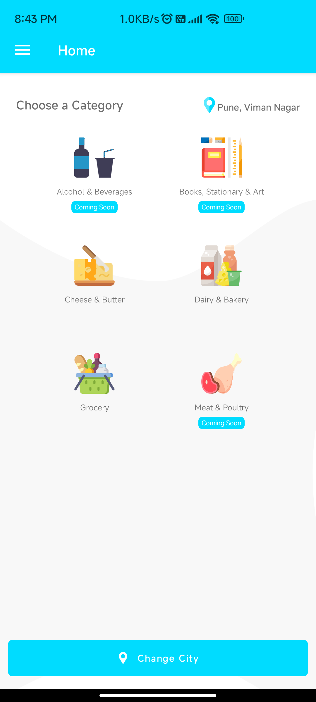
  &nbsp;&nbsp;
  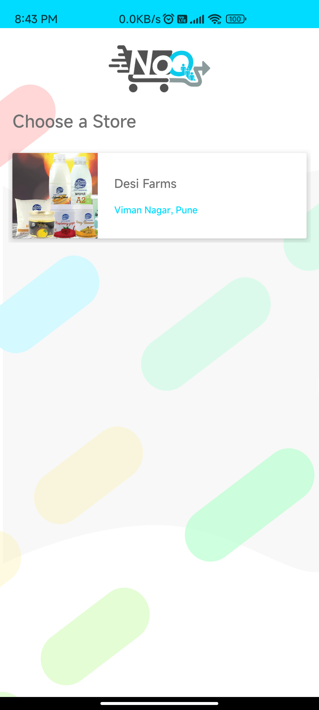
   &nbsp;&nbsp;
  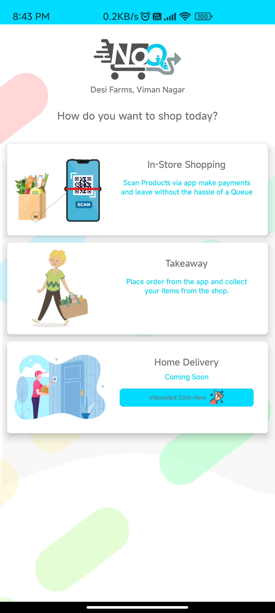

 

  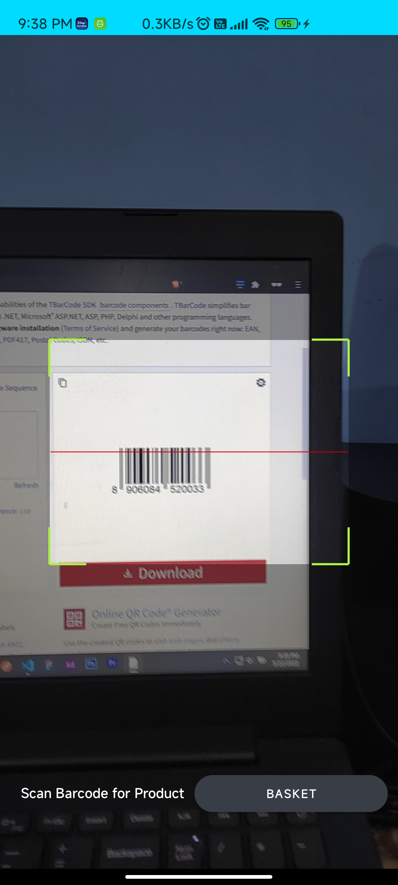
  &nbsp;&nbsp;
  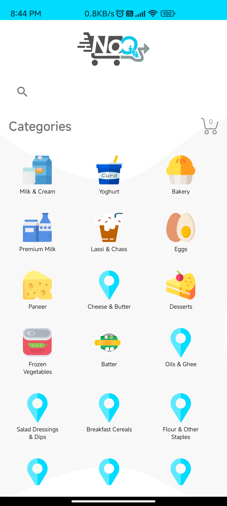
   &nbsp;&nbsp;
  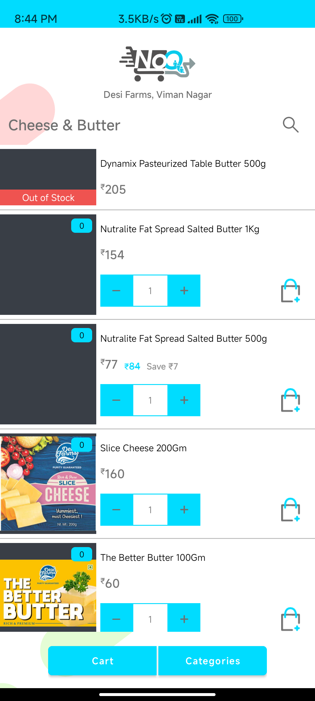

 

  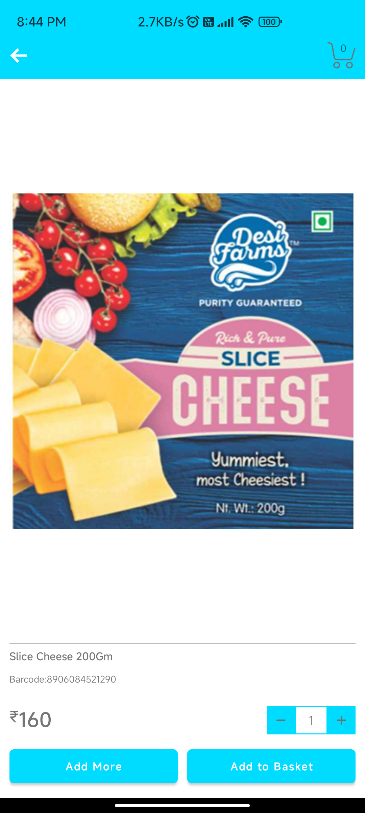
  &nbsp;&nbsp;
  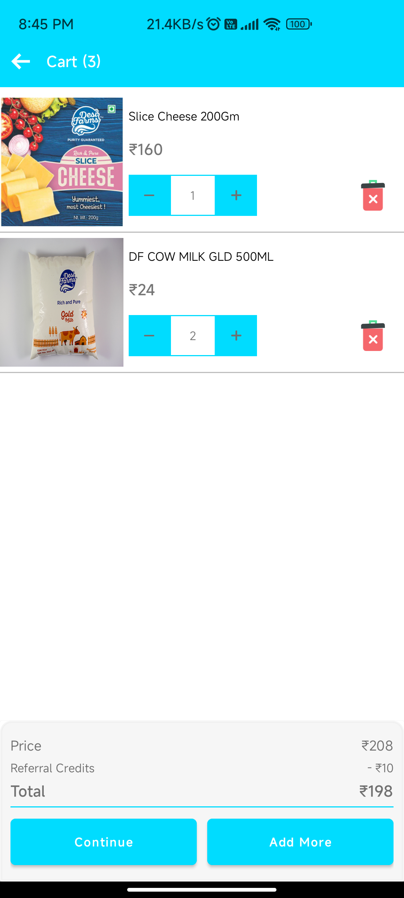
  &nbsp;&nbsp;
  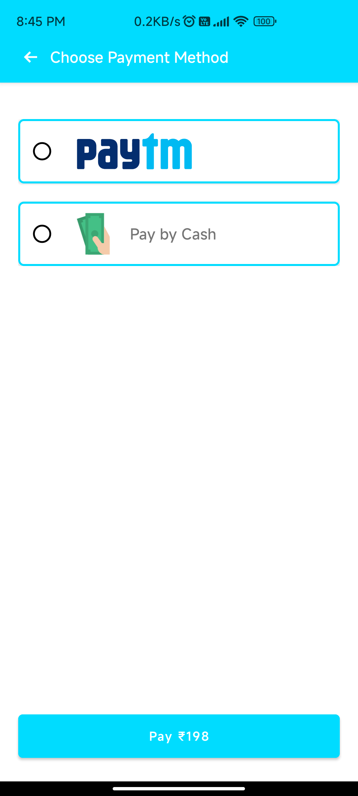

